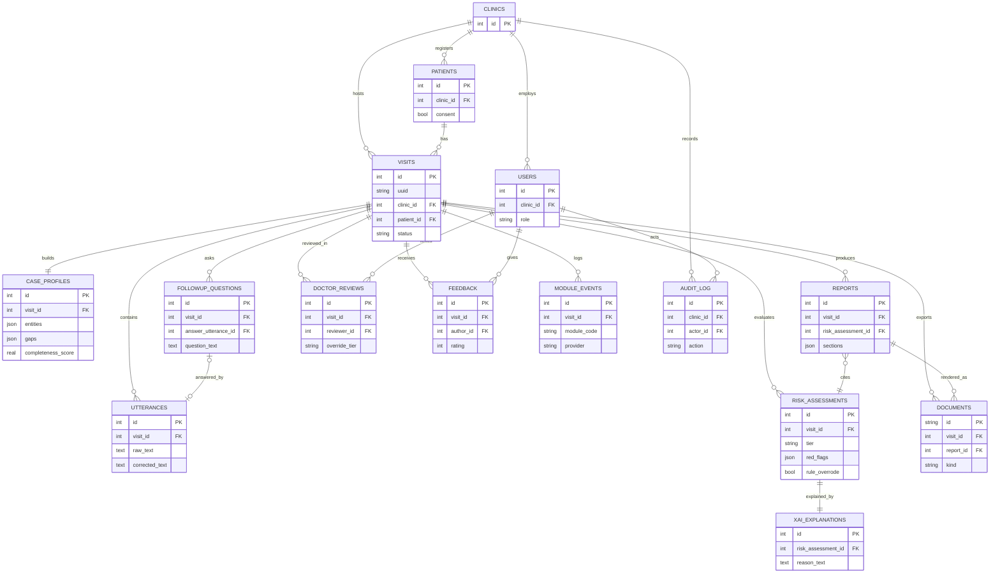

# architecture.md — Data Layer, API & Scalable Structure

> **Scope:** the persistent-data + API design for the AI voice medical pre-screening system.
> This is the concrete plan for **Module 13 (EHR Database)** and the routes that feed the
> patient pipeline (M1–M12) and the doctor side (M14–M15). It EXTENDS the locked stack
> (FastAPI + SQLite→Postgres via Alembic + plain HTML/JS, ADR-0025); it is **not** a rewrite.
>
> **Assumptions (stated, not asked):** one clinic for now but a `clinic_id` tenancy seam is
> included so multi-clinic is additive later; authentication is stubbed (the `users` table
> exists; real login is a later phase); all data is **synthetic/consented** during development
> (rule #4). SQLite today, Postgres later via one config URL — no schema rewrite.

---

## 0. Design principles that keep it extensible

Everything below serves one goal you asked for: *add future features without major changes.*
Eight rules make that true, and every table/endpoint choice traces back to one of them.

1. **Tenancy seam from day one.** A `clinic_id` on the top-level rows means going from one
   clinic to many is adding rows, not reshaping tables. You never pay to add it later.
2. **The `visit` is the aggregate root.** One pre-screening encounter = one `visit`; every
   pipeline output (utterances, profile, risk, report, review, feedback) hangs off it. Adding
   a new kind of output later means a new child table pointing at `visit`, with nothing
   existing touched.
3. **JSON payload columns for *evolving* structured data.** Extracted entities, information
   gaps, risk drivers and report sections live in `JSON` columns. Adding a new entity type or
   report field is a data change, **not** an Alembic migration. Promote a JSON field to a real
   column only when you need to filter/sort on it.
4. **Append-only for anything clinical or accountability-related.** Raw utterances, risk
   assessments, reviews, feedback and the audit log are never overwritten — new state is a new
   row. This preserves history (thesis evidence), satisfies rule #1 (raw immutable), and makes
   the safety story auditable (Flag 1).
5. **`module_events` keyed by `module_code` is the extensibility keystone.** Every module run
   is logged with its code (`M1`…`M15`, room for `M16`+). A future module needs **no schema
   change** — it's a new `module_code` value. This is literally the "add features without major
   changes" mechanism, and it doubles as per-module observability (latency, provider used,
   fallback — feeds `test_log.md` and Flag 5's WER/latency evidence).
6. **Source of truth vs. derived artifacts are separate.** The DB is truth; `.docx`/`.pdf`
   reports are **regenerable exports** (`documents` table). You can change the report format
   forever without migrating clinical data (ADR-0021).
7. **Config-driven infrastructure.** DB URL and LLM providers come from config/env, so
   SQLite→Postgres and provider swaps (ADR-0026) need zero code change.
8. **Provider + fallback recorded as data, not hardcoded branching.** Which API served each
   call is stored on `module_events`, so the free-tier strategy is observable and tunable
   without editing pipeline code.

---

## 1. Scalable folder structure

Extends the current repo (which already has `backend/app/{core,api,services,db}` + `frontend/`
+ Alembic). New pieces are marked **NEW**. One small service file per module; the pipeline is
orchestrated in one place; the doctor dashboard is a second static page.

```
voice-medical-prescreener/
├── CLAUDE.md · DESIGN-mintlify.md · INSTALL.md · README.md
├── requirements.txt                    # single cross-platform list (no new heavy deps)
├── .env.example                        # key NAMES only (GEMINI/GROQ/OPENROUTER, DATABASE_URL)
├── agent_docs/                         # the living project brain (this file lives here)
│
├── backend/
│   ├── alembic.ini
│   ├── migrations/versions/            # 0001, 0002 (built) → 0003+ add the tables below
│   ├── app/
│   │   ├── main.py                     # app factory: lifespan init/migrate, mounts routers + static
│   │   ├── core/
│   │   │   ├── config.py               # pydantic-settings: DB URL, per-module providers, TTS lang
│   │   │   ├── llm_providers.py        # NEW: registry (Gemini Flash / Flash-Lite / Groq / OpenRouter)
│   │   │   └── security.py             # NEW (stub): current-user dependency; real auth later
│   │   ├── db/
│   │   │   ├── database.py             # engine/session, run_migrations(), get_db()
│   │   │   ├── models.py               # ALL SQLAlchemy models (tables in §2)
│   │   │   └── repository/             # NEW: one repo module per aggregate (visits, risk, reports…)
│   │   ├── schemas/                    # Pydantic request/response models per resource
│   │   │   ├── visit.py · patient.py · profile.py · followup.py
│   │   │   ├── risk.py · report.py · review.py · feedback.py
│   │   ├── services/                   # ONE file per module (business logic; calls llm_client)
│   │   │   ├── llm_client.py           # NEW: call(provider_key, prompt) + automatic fallback + logs event
│   │   │   ├── correction/             # M2 (existing Corrector reused)
│   │   │   ├── extraction.py           # M3
│   │   │   ├── summary.py              # M4
│   │   │   ├── missing_info.py         # M6   (fed directly by M4 — no emergency branch)
│   │   │   ├── followup.py             # M7   (question text; spoken by browser TTS)
│   │   │   ├── profile_update.py       # M8
│   │   │   ├── completion.py           # M9   (LOCAL: completeness score + loop decision)
│   │   │   ├── risk.py                 # M10  (classify + red-flag override → Critical)
│   │   │   ├── red_flags.py            # M10  (the rule list — chest pain, stroke signs, …)
│   │   │   ├── xai.py                  # M11
│   │   │   ├── report.py               # M12  (assemble; Red Flags section; NO diagnosis)
│   │   │   └── documents/              # DocxWriter + storage (existing); PDF writer slots in
│   │   ├── pipeline/
│   │   │   └── orchestrator.py         # NEW: runs M1→M2→M3→M4→M6→(M7→M8→M9 loop)→M10→M11→M12→M13
│   │   └── api/                        # thin routers → services (resources in §3)
│   │       ├── routes_visits.py        # NEW (also folds in existing /api/transcripts, /api/correct)
│   │       ├── routes_followup.py · routes_report.py
│   │       ├── routes_documents.py     # existing
│   │       ├── routes_dashboard.py     # NEW (M14)
│   │       ├── routes_feedback.py      # NEW (M15)
│   │       └── routes_meta.py          # /health, /api/providers
│   └── tests/                          # per-module + per-route; TC-V1…TC-R1 from test_log.md
│
├── frontend/                           # patient kiosk (voice-only), Mintlify
│   ├── index.html · app.js · tts.js · styles.css
├── frontend_doctor/                    # NEW: doctor dashboard (second static page, M14)
│   ├── index.html · dashboard.js
└── docker/                             # OPTIONAL Phase I: ONE Dockerfile + one compose (single service)
```

Why this shape: the `api → services → repository → db` layering means a new feature usually
touches exactly one file per layer, and the `pipeline/orchestrator.py` seam means adding a
module is "insert one call + one service file," not a restructure.

---

## 2. Database schema

Types are written portably (SQLite today, Postgres later — `JSON` and timestamps map cleanly
through SQLAlchemy). IDs are integer surrogate keys except where a public/opaque id is useful
(`visits`, `documents` keep a UUID too). Every table carries `created_at`; append-only tables
never get an `UPDATE`.

### Core aggregate

```sql
-- Tenant root. One row now; the seam makes multi-clinic additive later.
CREATE TABLE clinics (
    id          INTEGER PRIMARY KEY,
    name        TEXT NOT NULL,
    created_at  TIMESTAMP NOT NULL DEFAULT now
);

-- Staff accounts (doctor / desk / admin). Auth is stubbed for now.
CREATE TABLE users (
    id          INTEGER PRIMARY KEY,
    clinic_id   INTEGER NOT NULL REFERENCES clinics(id),
    name        TEXT NOT NULL,
    role        TEXT NOT NULL CHECK (role IN ('doctor','desk','admin')),
    email       TEXT UNIQUE,
    created_at  TIMESTAMP NOT NULL DEFAULT now
);

-- The person being screened. Minimal PII; consent is explicit (rule #4).
CREATE TABLE patients (
    id           INTEGER PRIMARY KEY,
    clinic_id    INTEGER NOT NULL REFERENCES clinics(id),
    external_ref TEXT,                    -- optional clinic MRN / phone hash; nullable
    display_name TEXT,                    -- optional; may be "Anonymous"
    sex          TEXT,
    birth_year   INTEGER,                 -- year only, not full DOB (privacy)
    consent      BOOLEAN NOT NULL DEFAULT 0,
    created_at   TIMESTAMP NOT NULL DEFAULT now
);

-- ONE pre-screening encounter = one visit. The hub everything hangs off.
CREATE TABLE visits (
    id           INTEGER PRIMARY KEY,
    uuid         TEXT NOT NULL UNIQUE,    -- opaque id for URLs / kiosk hand-off
    clinic_id    INTEGER NOT NULL REFERENCES clinics(id),
    patient_id   INTEGER REFERENCES patients(id),   -- nullable: walk-in before patient is created
    status       TEXT NOT NULL DEFAULT 'in_progress'
                 CHECK (status IN ('in_progress','awaiting_review','reviewed','closed')),
    language     TEXT NOT NULL DEFAULT 'bn-BD',
    started_at   TIMESTAMP NOT NULL DEFAULT now,
    completed_at TIMESTAMP
);
```

### Pipeline data (M1–M12)

```sql
-- M1/M2. RAW is write-once (rule #1); corrected is a SEPARATE field. (Existing table, + visit_id.)
CREATE TABLE utterances (
    id            INTEGER PRIMARY KEY,
    visit_id      INTEGER NOT NULL REFERENCES visits(id),
    role          TEXT NOT NULL DEFAULT 'patient',   -- 'patient' | 'system' (a spoken question)
    seq           INTEGER NOT NULL,                  -- order within the visit
    raw_text      TEXT NOT NULL,                     -- IMMUTABLE — never UPDATEd
    corrected_text TEXT,                             -- M2 output; nullable until corrected
    stt_provider  TEXT,
    created_at    TIMESTAMP NOT NULL DEFAULT now,
    corrected_at  TIMESTAMP
);

-- M3/M4/M6/M8/M9. The evolving structured profile for a visit. Derived working state.
CREATE TABLE case_profiles (
    id                 INTEGER PRIMARY KEY,
    visit_id           INTEGER NOT NULL UNIQUE REFERENCES visits(id),
    entities           JSON,      -- M3: {symptoms, body_part, duration, severity, meds, history}
    summary            TEXT,      -- M4: chief-complaint summary (no diagnosis)
    gaps               JSON,      -- M6: present-vs-missing checklist
    completeness_score REAL,      -- M9: 0..1
    updated_at         TIMESTAMP NOT NULL DEFAULT now
);

-- M7/M8. Each generated follow-up question + the answer it maps to.
CREATE TABLE followup_questions (
    id             INTEGER PRIMARY KEY,
    visit_id       INTEGER NOT NULL REFERENCES visits(id),
    target_gap     TEXT,          -- which missing field this asks about
    question_text  TEXT NOT NULL, -- shown on screen AND spoken via TTS
    priority       INTEGER,
    answer_utterance_id INTEGER REFERENCES utterances(id),  -- nullable until answered (voice-only)
    asked_at       TIMESTAMP NOT NULL DEFAULT now,
    answered_at    TIMESTAMP
);

-- M10. Append-only: each assessment is a new row; latest is current. Red flags are first-class.
CREATE TABLE risk_assessments (
    id             INTEGER PRIMARY KEY,
    visit_id       INTEGER NOT NULL REFERENCES visits(id),
    tier           TEXT NOT NULL CHECK (tier IN ('low','medium','high','critical')),
    red_flags      JSON,          -- list of triggered red-flag phrases; [] if none
    rule_overrode  BOOLEAN NOT NULL DEFAULT 0,   -- true if the red-flag rule forced 'critical'
    model_provider TEXT,          -- which LLM produced the base classification
    created_at     TIMESTAMP NOT NULL DEFAULT now
);

-- M11. Plain-language reason for a specific risk assessment.
CREATE TABLE xai_explanations (
    id                 INTEGER PRIMARY KEY,
    risk_assessment_id INTEGER NOT NULL UNIQUE REFERENCES risk_assessments(id),
    reason_text        TEXT NOT NULL,
    drivers            JSON,      -- contributing factors, weighted
    created_at         TIMESTAMP NOT NULL DEFAULT now
);

-- M12. The doctor-facing report. NO diagnosis. Regenerable; sections are flexible JSON.
CREATE TABLE reports (
    id                 INTEGER PRIMARY KEY,
    visit_id           INTEGER NOT NULL REFERENCES visits(id),
    risk_assessment_id INTEGER REFERENCES risk_assessments(id),
    sections           JSON,      -- {summary, symptoms, timeline, red_flags, xai, disclaimer}
    created_at         TIMESTAMP NOT NULL DEFAULT now
);
```

### Derived artifacts, doctor side, and accountability (M13–M15 + audit)

```sql
-- Derived export files (.docx/.pdf). DB stays source of truth; these are regenerable. (Existing.)
CREATE TABLE documents (
    id          TEXT PRIMARY KEY,          -- UUID
    visit_id    INTEGER NOT NULL REFERENCES visits(id),
    report_id   INTEGER REFERENCES reports(id),      -- nullable (raw-transcript exports)
    kind        TEXT NOT NULL,             -- 'raw' | 'corrected' | 'report'
    format      TEXT NOT NULL DEFAULT 'docx',        -- 'docx' | 'pdf'
    filename    TEXT NOT NULL,
    rel_path    TEXT NOT NULL,
    created_at  TIMESTAMP NOT NULL DEFAULT now
);

-- M14. Doctor override + annotation. Append-only human-in-the-loop actions.
CREATE TABLE doctor_reviews (
    id             INTEGER PRIMARY KEY,
    visit_id       INTEGER NOT NULL REFERENCES visits(id),
    reviewer_id    INTEGER NOT NULL REFERENCES users(id),
    override_tier  TEXT CHECK (override_tier IN ('low','medium','high','critical')),  -- nullable
    disposition    TEXT,          -- e.g. 'send_to_doctor_now', 'routine', 'refer'
    notes          TEXT,
    created_at     TIMESTAMP NOT NULL DEFAULT now
);

-- M15. Feedback signal for continuous learning. Kept separate for later fine-tuning export.
CREATE TABLE feedback (
    id           INTEGER PRIMARY KEY,
    visit_id     INTEGER NOT NULL REFERENCES visits(id),
    author_id    INTEGER NOT NULL REFERENCES users(id),
    rating       INTEGER,         -- e.g. 1..5 on report usefulness
    correct      BOOLEAN,         -- was the risk tier judged correct?
    comment      TEXT,
    created_at   TIMESTAMP NOT NULL DEFAULT now
);

-- Cross-cutting audit trail. Append-only. New event types = new rows, no schema change.
CREATE TABLE audit_log (
    id           INTEGER PRIMARY KEY,
    clinic_id    INTEGER REFERENCES clinics(id),
    actor_id     INTEGER REFERENCES users(id),        -- nullable for system/patient actions
    action       TEXT NOT NULL,                       -- 'visit.create','risk.assess','doc.download',…
    entity_type  TEXT,                                -- 'visit' | 'report' | 'document' | …
    entity_id    TEXT,
    detail       JSON,
    created_at   TIMESTAMP NOT NULL DEFAULT now
);

-- Per-module execution log. THE extensibility keystone + observability (latency/provider/fallback).
CREATE TABLE module_events (
    id           INTEGER PRIMARY KEY,
    visit_id     INTEGER NOT NULL REFERENCES visits(id),
    module_code  TEXT NOT NULL,            -- 'M1'..'M15' (room for M16+ with NO schema change)
    status       TEXT NOT NULL,            -- 'ok' | 'fallback' | 'error'
    provider     TEXT,                     -- which API served it (Gemini/Groq/OpenRouter/local)
    latency_ms   INTEGER,
    error        TEXT,
    created_at   TIMESTAMP NOT NULL DEFAULT now
);
```

### Why each table exists (one line each)

- **clinics** — tenancy root; makes "one clinic → many" additive instead of a rewrite (principle 1).
- **users** — attribution for reviews/feedback/audit and the seam for real auth (M14/M15).
- **patients** — lets one person have many visits over time; isolates PII + consent (rule #4).
- **visits** — the aggregate root; the single unit a whole pre-screening pipeline attaches to (principle 2).
- **utterances** — M1/M2; keeps **raw immutable** and corrected separate (rule #1); one visit → many turns.
- **case_profiles** — M3/M4/M6/M8/M9 working state; JSON `entities`/`gaps` evolve without migrations (principle 3).
- **followup_questions** — M7/M8/M9 loop; records what was asked so questions don't repeat, and links each to its voice answer.
- **risk_assessments** — M10; append-only so re-assessment history survives; `red_flags`/`rule_overrode` make the safety override queryable (Flag 1).
- **xai_explanations** — M11; guarantees every risk output has a stored reason (constitution) while keeping the risk row lean.
- **reports** — M12; the doctor deliverable; `sections` JSON lets the report grow without migrations; **no diagnosis** (rule #2).
- **documents** — M13 export layer; derived + regenerable so report formatting can change forever without touching clinical data (principle 6).
- **doctor_reviews** — M14; human override/annotation, append-only for accountability.
- **feedback** — M15; separated training signal for later fine-tuning.
- **audit_log** — rule #4 + medical accountability; append-only, extensible by adding action strings.
- **module_events** — the keystone: new modules and per-module metrics with **no schema change** (principles 5 & 8).

### Why the key relationships exist

- `patients 1—* visits` — a person returns; each encounter is its own pipeline run and report.
- `visits 1—* utterances / followup_questions / risk_assessments / reports / …` — the aggregate-root
  pattern: adding a new output type later is a new child table on `visit`, nothing else changes.
- `followup_questions *—1 utterances` (the answer) — closes the M7→M8 loop and enforces voice-only
  answers (the answer *is* an utterance, not a free-text field).
- `risk_assessments 1—1 xai_explanations` — every risk must be explainable, but the explanation is
  regenerable and kept out of the hot risk row.
- `reports *—1 risk_assessments` — a report cites the exact assessment it was built from (auditability).
- `reports 1—* documents` — one report can be exported to several formats/versions.
- `users 1—* doctor_reviews / feedback` — attribution for the human-in-the-loop.
- `* → audit_log` (soft `entity_type`+`entity_id`) — a deliberately *loose* link so any table can be
  audited without a hard FK per table (extensible).

---

## 3. ER diagram



---

## 4. REST API endpoints

Versioned under `/api`. Resource-oriented and nested under `visits`, so the whole patient
journey reads as operations on one growing object. The existing flat endpoints
(`/api/transcripts`, `/api/correct`, `/api/documents`) are kept as aliases during migration,
then fold into the nested forms — no breaking change for the current frontend.

**Meta / health**
| Method | Path | Purpose |
|---|---|---|
| GET | `/health` | Liveness. |
| GET | `/api/providers` | Which LLM providers are configured + reachable (feeds Flag 3 / TC-A1). |

**Visits & intake (M1–M6)**
| Method | Path | Purpose |
|---|---|---|
| POST | `/api/visits` | Start a visit (optionally create/attach a patient) → `{uuid}`. |
| GET | `/api/visits` | List visits (dashboard; filter by `status`, `tier`, `date`). |
| GET | `/api/visits/{uuid}` | Full visit detail (profile, latest risk, report links). |
| POST | `/api/visits/{uuid}/utterances` | Store a **raw** utterance (M1). *(supersedes `/api/transcripts`)* |
| POST | `/api/visits/{uuid}/utterances/{id}/correct` | Run M2 on one utterance. *(supersedes `/api/correct`)* |
| POST | `/api/visits/{uuid}/intake` | Run M2→M3→M4→M6 over collected utterances → `{summary, gaps}`. |
| GET | `/api/visits/{uuid}/profile` | Current `case_profile` (entities, summary, gaps, completeness). |

**Follow-up loop (M7–M9)**
| Method | Path | Purpose |
|---|---|---|
| POST | `/api/visits/{uuid}/followup/next` | M7: next prioritized question (text; frontend also speaks it). |
| POST | `/api/visits/{uuid}/followup/answer` | M8+M9: accept the voice answer, update profile, return `{complete, next?}`. |

**Risk, explanation, report (M10–M13)**
| Method | Path | Purpose |
|---|---|---|
| POST | `/api/visits/{uuid}/assess` | M10: risk tier + red-flag check (rule can force `critical`). |
| GET | `/api/visits/{uuid}/risk` | Latest `risk_assessment` + its `xai_explanation`. |
| POST | `/api/visits/{uuid}/report` | M12: generate/refresh the structured report. |
| GET | `/api/visits/{uuid}/report` | Fetch the report (JSON sections). |
| GET | `/api/visits/{uuid}/documents` | List export files for the visit. |
| POST | `/api/visits/{uuid}/documents/{kind}` | Generate a `raw` / `corrected` / `report` export. |
| GET | `/api/documents/{id}/download` | Download a file (existing). |

**Doctor side (M14–M15)**
| Method | Path | Purpose |
|---|---|---|
| GET | `/api/dashboard` | Review queue: visits with risk, red flags, XAI (critical highlighted). |
| POST | `/api/visits/{uuid}/review` | M14: doctor override tier / disposition / notes. |
| POST | `/api/visits/{uuid}/feedback` | M15: rating + correctness signal for learning. |

Design notes: writes that trigger a pipeline stage always return the **updated visit slice** so
the voice-only frontend needs no second round-trip; every state-changing call writes an
`audit_log` row and a `module_events` row (provider + latency) so the free-tier strategy and
per-module metrics are observable without extra endpoints.

---

## 5. Development roadmap

This layers onto the locked Phase A–I build plan; it sequences the schema by Alembic revision
so the DB grows in safe, reviewable steps (ADR-0022: new revision per change, never edit an
applied one, never delete the DB).

| Stage | Alembic rev | Tables added | Endpoints lit up | Gate to move on |
|---|---|---|---|---|
| **G0 — Aggregate root** | `0003` | `clinics`, `users`, `patients`, `visits`; add `visit_id` to `utterances`/`documents` | `POST/GET /api/visits`, generalized utterance routes | A visit is created; an utterance stores against it; old data preserved on migrate. |
| **G1 — Intake profile** | `0004` | `case_profiles`, `module_events` | `/intake`, `/profile` | M2→M4→M6 write a profile; each run logs a `module_event` with provider + latency. |
| **G2 — Follow-up loop** | `0005` | `followup_questions` | `/followup/next`, `/followup/answer` | Loop asks only missing items, exits on completeness (TC-F2); answers are voice utterances. |
| **G3 — Risk + XAI** | `0006` | `risk_assessments`, `xai_explanations` | `/assess`, `/risk` | Red-flag phrases force `critical` with no misses (TC-R1); every risk has a stored reason. |
| **G4 — Report + export** | `0007` | `reports` | `/report`, `/documents/{kind}` | A no-diagnosis report with a Red Flags section generates and exports to `.docx`. |
| **G5 — Doctor side** | `0008` | `doctor_reviews`, `feedback` | `/dashboard`, `/review`, `/feedback` | Dashboard shows the queue; a doctor can override + annotate; feedback is stored. |
| **G6 — Accountability** | `0009` | `audit_log` | (cross-cutting) | Every state change writes an audit row; download/override are traceable (rule #4). |
| **G7 — Scale prep** | *config only* | — | — | Point `DATABASE_URL` at Postgres; app runs unchanged. Optional single-container deploy (Phase I). |

Two things stay true across every stage so future features don't force a rewrite: new outputs
attach to `visits` as new child tables, and new modules appear as new `module_code` values in
`module_events` — neither disturbs what already ships.

---

## 6. Open design choices to confirm

1. **`case_profiles` mutable vs. snapshotted.** It's modelled as one mutable row per visit
   (derived working state; the *raw* source in `utterances` stays immutable). If you want a
   full audit of how the profile evolved turn-by-turn, switch it to append-only
   `profile_snapshots` — recommended default: keep it mutable, since `module_events` +
   `utterances` already reconstruct the history.
2. **When to move JSON → columns.** `entities`, `gaps`, `red_flags`, `sections` are JSON for
   flexibility. Promote a field to a real column only when you need to filter/sort on it in SQL
   (e.g. if you later query "all visits with symptom X"). Recommended default: keep JSON until a
   real query needs otherwise.
3. **Postgres timing.** SQLite is fine through the capstone demo. Recommended default: switch
   only if you need concurrent writers or deploy to a PaaS that prefers Postgres — and it's just
   the config URL when you do.

---

## 7. Mockup reconciliation deltas (2026-07-03 — see `reconciliation.md`)

The three-portal UI mockup (`mockups-redesign.html`) was reconciled against this document
(full table + approved build plan: `agent_docs/reconciliation.md`, ADR-0029/0030). Four
small deltas were approved; all land inside the **not-yet-written rev `0003`**, so no
applied migration is edited and every §0 principle holds:

1. **`users.role` CHECK gains `'medic'`** — a real triage-staff role (verifies the
   extracted fields, assigns a doctor) distinct from `desk`.
2. **`visits.status` CHECK gains `'awaiting_doctor'`** — flow: patient submit →
   `awaiting_review` (medic queue) → medic forward → `awaiting_doctor` (doctor queue)
   → doctor accept → `reviewed`. The kiosk auto-logout itself is frontend-only state.
3. **`visits.assigned_doctor_id`** — nullable FK → `users.id`, set by the medic's
   "Submit & Forward". Assignment is a workflow attribute of the aggregate root;
   `doctor_reviews` stays append-only doctor actions.
4. **`case_profiles.entities.summary_fields`** — the mockup's 10-fixed-field summary is a
   Pydantic-enforced JSON shape (per-field `{value, source: 'ai'|'human', edited_by?,
   edited_at?}`), NOT promoted columns (§6.2 rule respected). Staff edits are additionally
   logged append-only in `audit_log` (`profile.field_edit`).

Non-schema resolutions: patient phone lives in `patients.external_ref` with a **stubbed**
OTP verify (`DEV_OTP` env; no session table — the kiosk session is `visits.uuid`); the
mockup's "Moderate" badge is a display label for tier `'medium'` (one shared frontend
`TIER_LABELS` map); the mockup's clinical-blue visual system supersedes the Mintlify rule
(ADR-0029, a flagged + human-approved locked-doc change).

## 8. Session-9 fix/feature deltas (2026-07-05 — rev `0010`, ADR-0032; spec: `context_fixed_problem.md`)

The human's Part-2 live test produced a bug/feature spec whose approved decisions add one
migration (**`0010_prescriptions_letterhead`**, applied) — every §0 principle holds:

1. **`documents.utterance_id` becomes NULLABLE** — visit-grain exports (full-visit raw
   transcript KIOSK-4, staff summary report MEDIC-7, prescription DOCTOR-6) have no single
   source utterance; they set `visit_id` only. New `documents.kind` values
   (`'transcript' | 'summary_report' | 'prescription'`) are data-level (no CHECK on kind).
2. **`patients.weight_kg` + `patients.bp`** — vitals for the staff detail views
   (DOCTOR-3/MEDIC-6); weight is medic-editable. Age/gender were already `birth_year`/`sex`.
3. **`users.qualification` / `registration_no` / `specialization` / `signature_path`** and
   **`clinics.address` / `logo_path`** — reusable, editable prescription letterhead
   (DOCTOR-4; human decision: DB-backed, not static config).
4. **New `prescriptions` table** — `id, visit_id FK, doctor_id FK, payload JSON,
   document_id FK → documents, created_at, updated_at`. The form lives in `payload`
   (§0 principle 3: evolving shapes are JSON); the `Diagnosis` inside it is typed by the
   human doctor and is NEVER AI-filled (rule #2, decision C1). `document_id` links the
   exported `.docx`, retrievable later by both doctor and patient.

Non-schema resolutions this session: risk "score" is a **display-only tier→band map** in
`shared.js` (decision C2 — no numeric score generated or stored); bilingual summary values
are stored as `value_bn`/`value_en` inside the existing `summary_fields` JSON (no
migration); the legacy Phase-0 demo moved to `/legacy/` with a landing page at `/`
(ADR-0031).
